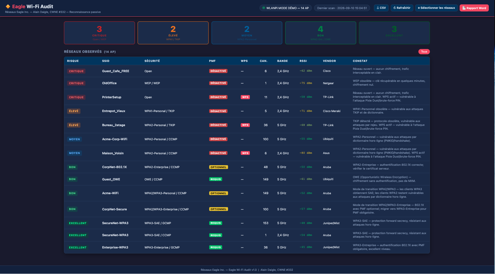

# Eagle Wi-Fi Audit

[🇫🇷 Français](README.md) | 🇬🇧 English

Passive Wi-Fi security posture audit web application for network professionals.  
Developed by **Alain Daigle, CWNE #332** — [Réseaux Eagle Inc.](https://reseauxeagle.ca)


---

## Interface



---

## Overview

Eagle Wi-Fi Audit passively captures Wi-Fi beacon frames via a **WLANPi** connected over USB, classifies each network across 5 risk levels, and generates a professional Word report ready to deliver to clients.

| Level | Criteria | Examples |
|---|---|---|
| 🔴 CRITICAL | Open or WEP | No password, WEP encryption |
| 🟠 HIGH | WPA1 or TKIP | WPA1-Personal, TKIP detected |
| 🟡 MEDIUM | WPA2-Personal | WPA2-PSK |
| 🟢 GOOD | WPA2-Enterprise, OWE, WPA2/WPA3 Transition | 802.1X, OWE |
| 🔵 EXCELLENT | WPA3-SAE or WPA3-Enterprise | WPA3, WPA3-Enterprise |

**Features:**
- Passive capture (no association, no traffic injection)
- Detects: Open, WEP, WPA1, WPA2, WPA3, OWE, transition modes, WPS, PMF
- Vendor identification (OUI lookup)
- CSV export
- Word report (.docx) with executive summary, network table, and recommendations
- **Demo mode** — no WLANPi required to explore the interface and test reports

---

## ⚠️ Security & Legal Notice

> **This tool is intended for authorized Wi-Fi audits only.**

Eagle Wi-Fi Audit operates in **passive mode only** — it listens to beacon frames publicly broadcast by access points without associating, injecting traffic, or modifying any network configuration.

**Authorized use:**
- Wi-Fi posture audits commissioned by the network owner
- Wi-Fi penetration testing with written authorization
- Training and demonstrations in controlled lab environments

**Prohibited use:**
- Auditing a network without explicit owner authorization
- Passive collection in public spaces for surveillance purposes
- Any use that violates local laws on interception of communications

The user is solely responsible for compliance with applicable laws in their jurisdiction.

---

## Requirements

### Hardware
- **WLANPi** (R4 or Pro) with a Wi-Fi interface in monitor mode — [wlanpi.com](https://wlanpi.com)
- USB connection between the WLANPi and the computer (link-local `169.254.42.1`)

> Without a WLANPi, use **demo mode** to explore the interface.

### Software
- **Python 3.10 or higher**
- pip

---

## Installation — macOS

### 1. Install Python

Download Python 3.12 from [python.org](https://www.python.org/downloads/) and install it.

Verify:
```bash
python3 --version
```

### 2. Clone the repository

```bash
git clone https://github.com/adaigle18/eagle-wifi-audit.git
cd eagle-wifi-audit
```

### 3. Create a virtual environment and install dependencies

```bash
python3 -m venv venv
source venv/bin/activate
pip install -r requirements.txt
```

### 4. Launch the application

```bash
source venv/bin/activate
python wifi_audit.py
```

Open your browser at: **http://127.0.0.1:5002**

---

## Installation — Windows

### 1. Install Python

Download Python 3.12 from [python.org](https://www.python.org/downloads/).  
**Important:** Check **"Add Python to PATH"** during installation.

Verify in PowerShell or Command Prompt:
```cmd
python --version
```

### 2. Clone the repository

```cmd
git clone https://github.com/adaigle18/eagle-wifi-audit.git
cd eagle-wifi-audit
```

> If Git is not installed: [git-scm.com](https://git-scm.com/download/win)

### 3. Create a virtual environment and install dependencies

```cmd
python -m venv venv
venv\Scripts\activate
pip install -r requirements.txt
```

### 4. Launch the application

```cmd
venv\Scripts\activate
python wifi_audit.py
```

Open your browser at: **http://127.0.0.1:5002**

---

## Usage

### Connecting the WLANPi

1. Plug the WLANPi via USB — the address `169.254.42.1` is assigned automatically.
2. Run `python wifi_audit.py`.
3. The app detects the WLANPi within 10 seconds and triggers a scan automatically.
4. Connection status is shown in the top-right banner of the interface.

### Web interface

| Element | Description |
|---|---|
| **Summary cards** | Network counts by risk level, clickable to filter |
| **AP table** | SSID, BSSID, vendor, security, channel, RSSI, finding |
| **Refresh button** | Triggers an immediate new scan |
| **Export CSV** | Downloads all networks as a CSV file |
| **Generate report** | Opens the Word report form |

### Generating a Word report

1. Click **Report Word** in the interface.
2. Fill in: client name, site, mandate number, auditor, scan duration.
3. Select the SSIDs to include (or select all).
4. Click **Download** — the `.docx` file is generated and downloaded automatically.

The report includes:
- Executive summary with risk breakdown
- Audit scope and method
- Findings summary
- Detailed network table
- Priority recommendations (R1 to R6)
- Passive audit limitations
- Protocol resistance tables

---

## Demo mode (no WLANPi required)

Demo mode loads 14 fictional networks covering all risk levels. Ideal for exploring the interface, testing report generation, or running a client demonstration.

**macOS / Linux:**
```bash
source venv/bin/activate
EAGLE_DEMO=1 python wifi_audit.py
```

**Windows (PowerShell):**
```powershell
venv\Scripts\Activate.ps1
$env:EAGLE_DEMO="1"
python wifi_audit.py
```

**Windows (Command Prompt):**
```cmd
venv\Scripts\activate
set EAGLE_DEMO=1
python wifi_audit.py
```

---

## Configuration

Parameters are at the top of `wifi_audit.py`:

| Parameter | Default | Description |
|---|---|---|
| `WLANPI_HOST` | `169.254.42.1` | WLANPi IP address (USB link-local) |
| `WLANPI_USER` | `wlanpi` | WLANPi SSH username |
| `WLANPI_PASSWORD` | `wlanpi` | SSH password (official WLANPi default) |
| `WLANPI_IFACE` | `wlan1` | Wi-Fi interface on the WLANPi |
| `REFRESH_INTERVAL` | `60` | Seconds between automatic scans |
| `PROBE_INTERVAL` | `10` | Seconds between connection checks |

---

## Dependencies

| Package | Purpose |
|---|---|
| `flask` | Web server and API routes |
| `paramiko` | SSH connection to WLANPi |
| `python-docx` | Word report generation |

---

## Project structure

```
eagle-wifi-audit/
├── wifi_audit.py        # Main Flask app (routes, threads, demo mode)
├── audit_scanner.py     # WLANPi SSH, tshark/iw parser, risk classification
├── report_generator.py  # .docx report generation (7 sections)
├── templates/
│   └── index.html       # Web interface (HTML/CSS/JS, no framework)
├── requirements.txt
└── README.md
```

---

## License

Distributed under the **MIT** license.  
© 2026 Réseaux Eagle Inc. — Alain Daigle, CWNE #332
