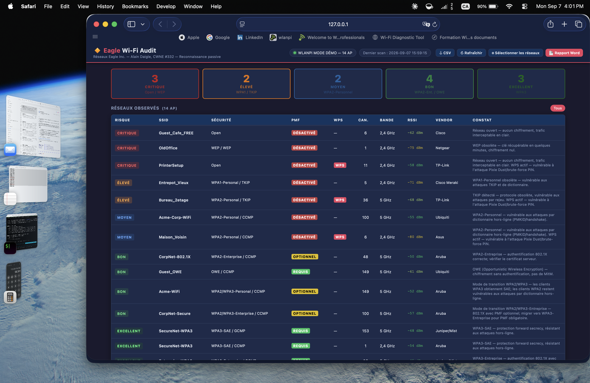

# Eagle Wi-Fi Audit

Application web d'audit de posture Wi-Fi passif pour les professionnels réseaux.  
Développée par **Alain Daigle, CWNE #332** — [Réseaux Eagle Inc.](https://reseauxeagle.ca)


---

## Interface



---

## Aperçu

Eagle Wi-Fi Audit capture passivement les trames beacon Wi-Fi via un **WLANPi** connecté en USB, les classifie selon 5 niveaux de risque, et génère un rapport Word professionnel prêt à remettre au client.

| Niveau | Critère | Exemple |
|---|---|---|
| 🔴 CRITIQUE | Open ou WEP | Réseau sans mot de passe, WEP |
| 🟠 ÉLEVÉ | WPA1 ou TKIP | WPA1-Personnel, TKIP détecté |
| 🟡 MOYEN | WPA2-Personnel | WPA2-PSK |
| 🟢 BON | WPA2-Entreprise, OWE, Transition WPA2/WPA3 | 802.1X, OWE |
| 🔵 EXCELLENT | WPA3-SAE ou WPA3-Entreprise | WPA3, WPA3-Enterprise |

**Fonctionnalités :**
- Capture passive (aucune association, aucun trafic généré)
- Détection : Open, WEP, WPA1, WPA2, WPA3, OWE, modes de transition, WPS, PMF
- Identification du fabricant (OUI lookup)
- Export CSV
- Rapport Word (.docx) avec sommaire exécutif, tableau des réseaux et recommandations
- **Mode démo** sans WLANPi pour tester l'interface et les rapports

---

## ⚠️ Sécurité & Usage légal

> **Cet outil est réservé aux audits Wi-Fi autorisés.**

Eagle Wi-Fi Audit opère en **mode passif uniquement** — il écoute les trames beacon diffusées publiquement par les points d'accès sans s'y associer, sans injecter de trafic et sans modifier la configuration réseau.

**Utilisation autorisée :**
- Audits de posture Wi-Fi commandés par le propriétaire du réseau
- Tests de pénétration Wi-Fi avec autorisation écrite
- Formations et démonstrations en environnement de laboratoire

**Utilisation interdite :**
- Audit d'un réseau sans autorisation explicite du propriétaire
- Collecte passive dans un lieu public à des fins de surveillance
- Toute utilisation contrevenant aux lois locales sur l'interception des communications

Au Canada, la collecte de données Wi-Fi est encadrée par la **Loi sur la protection des renseignements personnels et les documents électroniques (LPRPDE)** et le **Code criminel (art. 184)**. L'utilisateur est seul responsable du respect des lois applicables dans sa juridiction.

---

## Prérequis

### Matériel
- **WLANPi** (R4 ou Pro) avec une interface Wi-Fi en mode monitor — [wlanpi.com](https://wlanpi.com)
- Connexion USB entre le WLANPi et l'ordinateur (link-local `169.254.42.1`)

> Sans WLANPi, utiliser le **mode démo** pour explorer l'interface.

### Logiciel
- **Python 3.10 ou supérieur**
- pip

---

## Installation — macOS

### 1. Installer Python

Télécharger Python 3.12 depuis [python.org](https://www.python.org/downloads/) et l'installer.

Vérifier :
```bash
python3 --version
```

### 2. Cloner le dépôt

```bash
git clone https://github.com/adaigle18/eagle-wifi-audit.git
cd eagle-wifi-audit
```

### 3. Créer un environnement virtuel et installer les dépendances

```bash
python3 -m venv venv
source venv/bin/activate
pip install -r requirements.txt
```

### 4. Lancer l'application

```bash
source venv/bin/activate
python wifi_audit.py
```

Ouvrir le navigateur à l'adresse : **http://127.0.0.1:5002**

---

## Installation — Windows

### 1. Installer Python

Télécharger Python 3.12 depuis [python.org](https://www.python.org/downloads/).  
**Important :** Cocher **"Add Python to PATH"** lors de l'installation.

Vérifier dans PowerShell ou l'invite de commandes :
```cmd
python --version
```

### 2. Cloner le dépôt

```cmd
git clone https://github.com/adaigle18/eagle-wifi-audit.git
cd eagle-wifi-audit
```

> Si Git n'est pas installé : [git-scm.com](https://git-scm.com/download/win)

### 3. Créer un environnement virtuel et installer les dépendances

```cmd
python -m venv venv
venv\Scripts\activate
pip install -r requirements.txt
```

### 4. Lancer l'application

```cmd
venv\Scripts\activate
python wifi_audit.py
```

Ouvrir le navigateur à l'adresse : **http://127.0.0.1:5002**

---

## Utilisation

### Connexion du WLANPi

1. Brancher le WLANPi en USB — l'adresse `169.254.42.1` est assignée automatiquement.
2. Lancer `python wifi_audit.py`.
3. L'application détecte le WLANPi en 10 secondes et déclenche un scan automatiquement.
4. Le statut de connexion est affiché dans l'interface (bandeau en haut à droite).

### Interface web

| Élément | Description |
|---|---|
| **Cards de synthèse** | Compteurs par niveau de risque, cliquables pour filtrer |
| **Tableau des APs** | SSID, BSSID, fabricant, sécurité, canal, RSSI, constat |
| **Bouton Rafraîchir** | Déclenche un nouveau scan immédiat |
| **Exporter CSV** | Télécharge tous les réseaux en fichier CSV |
| **Générer le rapport** | Ouvre le formulaire de rapport Word |

### Générer un rapport Word

1. Cliquer sur **Générer le rapport** dans l'interface.
2. Remplir : nom du client, site, numéro de mandat, auditeur, durée du scan.
3. Sélectionner les SSIDs à inclure (ou tout sélectionner).
4. Cliquer **Télécharger** — le fichier `.docx` est généré et téléchargé automatiquement.

Le rapport contient :
- Sommaire exécutif avec répartition des risques
- Portée et méthode d'audit
- Synthèse des constats
- Tableau détaillé des réseaux
- Recommandations prioritaires (R1 à R6)
- Limites de l'audit passif
- Tableaux de résistance des protocoles

---

## Mode démo (sans WLANPi)

Le mode démo charge 14 réseaux fictifs couvrant tous les niveaux de risque. Idéal pour découvrir l'interface, tester la génération de rapport, ou faire une démonstration client.

**macOS / Linux :**
```bash
source venv/bin/activate
EAGLE_DEMO=1 python wifi_audit.py
```

**Windows (PowerShell) :**
```powershell
venv\Scripts\Activate.ps1
$env:EAGLE_DEMO="1"
python wifi_audit.py
```

**Windows (Invite de commandes) :**
```cmd
venv\Scripts\activate
set EAGLE_DEMO=1
python wifi_audit.py
```

---

## Configuration

Les paramètres se trouvent en haut de `wifi_audit.py` :

| Paramètre | Défaut | Description |
|---|---|---|
| `WLANPI_HOST` | `169.254.42.1` | Adresse IP du WLANPi (link-local USB) |
| `WLANPI_USER` | `wlanpi` | Utilisateur SSH du WLANPi |
| `WLANPI_PASSWORD` | `Root1234` | Mot de passe SSH (défaut officiel WLANPi) |
| `WLANPI_IFACE` | `wlan1` | Interface Wi-Fi sur le WLANPi |
| `REFRESH_INTERVAL` | `60` | Secondes entre les scans automatiques |
| `PROBE_INTERVAL` | `10` | Secondes entre les vérifications de connexion |

---

## Dépendances

| Paquet | Usage |
|---|---|
| `flask` | Serveur web et routes API |
| `paramiko` | Connexion SSH au WLANPi |
| `python-docx` | Génération des rapports Word |

---

## Structure du projet

```
eagle-wifi-audit/
├── wifi_audit.py        # Application Flask principale (routes, threads, mode démo)
├── audit_scanner.py     # Connexion SSH WLANPi, parser tshark/iw, classification risque
├── report_generator.py  # Génération du rapport .docx (7 sections)
├── templates/
│   └── index.html       # Interface web (HTML/CSS/JS, sans framework)
├── requirements.txt
└── README.md
```

---

## Licence

Distribué sous licence **MIT**.  
© 2026 Réseaux Eagle Inc. — Alain Daigle, CWNE #332
